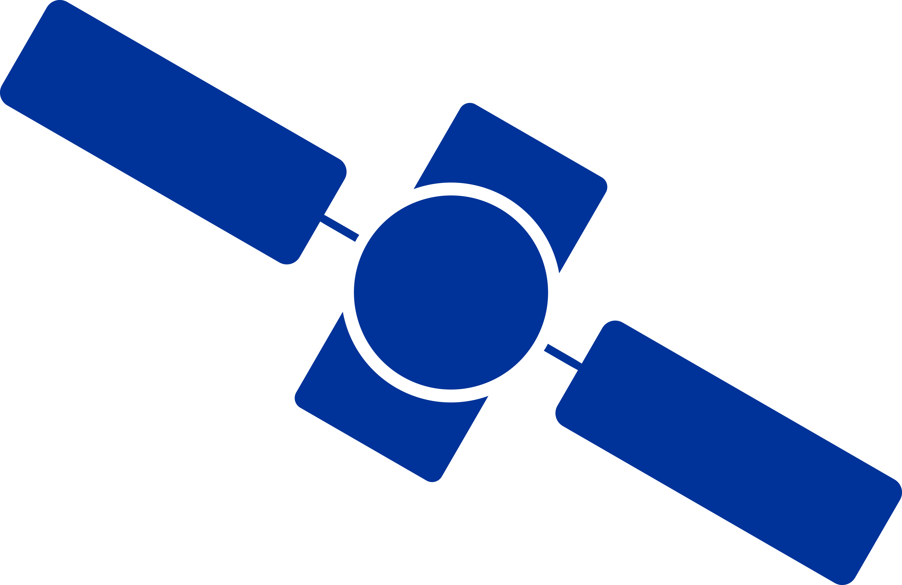

.. GNSS Compare documentation master file, created by
   sphinx-quickstart on Tue Jun 12 00:54:52 2018.
   You can adapt this file completely to your liking, but it should at least
   contain the root `toctree` directive.

Introduction
========================================

Welcome to GNSS Compare's documentation!

Please stay tuned, as this is still a demo version...

.. toctree::
   :maxdepth: 2
   :caption: Contents

   description
   amazing_team
   user_manual
   android_gnssMeasurements
   implemented_algorithms
   glossary
