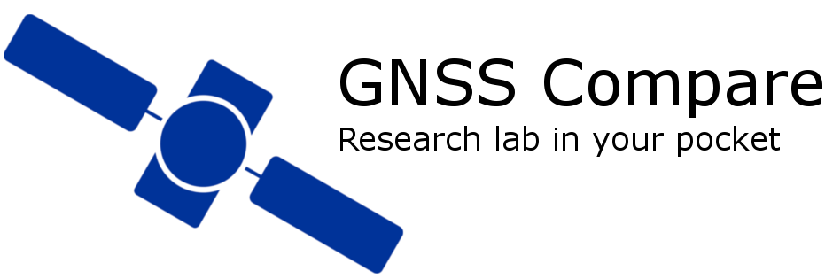

.. GNSS Compare documentation master file, created by
   sphinx-quickstart on Tue Jun 12 00:54:52 2018.
   You can adapt this file completely to your liking, but it should at least
   contain the root `toctree` directive.

************
Introduction
************

**GNSS Compare now supports the Dual-Frequency Xiaomi Mi 8 smartphone!**

Welcome to GNSS Compare's documentation!

Please stay tuned, this is still a beta version, and we're making updates on a daily basis...

Check out the app on `Play Store <https://play.google.com/store/apps/details?id=com.galfins.gnss_compare>`_.

.. image:: img/get_it_on_play_store.png
    :width: 30%
    :align: center
    :alt: Get it on Play Store
    :target: https://play.google.com/store/apps/details?id=com.galfins.gnss_compare

Please note that you need Android 7.0+ to run the application. Also, please note that not all Android 7.0+ phones support the Galileo Satellite System or crucial for this project raw GNSS measurements. The list of compatible phones can be found `here <https://developer.android.com/guide/topics/sensors/gnss>`_.

So far we've been testing the application on:

- Samsung Galaxy S8
- Samsung Galaxy S8+
- Samsung Galaxy Note 8
- Xiaomi Mi 8

And we are very happy with the results!

If you want to be kept up to date with our updates, you can sign up to our `newsletter <https://goo.gl/forms/Ws96HE3J703Khrdp2>`_!

.. toctree::
    :maxdepth: 2
    :caption: GNSS Compare

    description
    useful_links
    download
    team
    android_gnssMeasurements
    glossary
    acknowledgements
    newsletter

.. toctree::
    :maxdepth: 2
    :caption: User manual

    user_manual/intro.rst
    user_manual/ui_description.rst
    user_manual/code_basics.rst
    user_manual/gnss_basics.rst
    user_manual/android_gnssMeasurements.rst
    user_manual/implemented_algorithms.rst
    user_manual/example_analysis.rst
