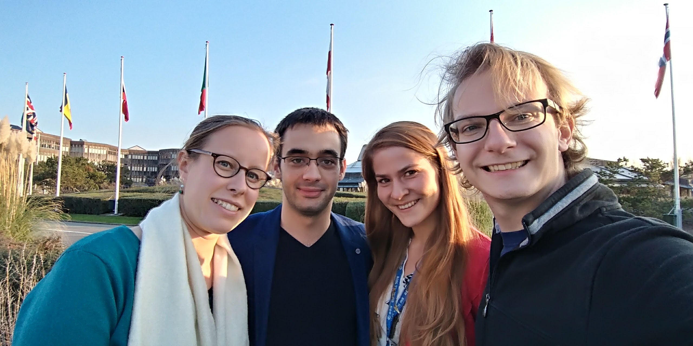
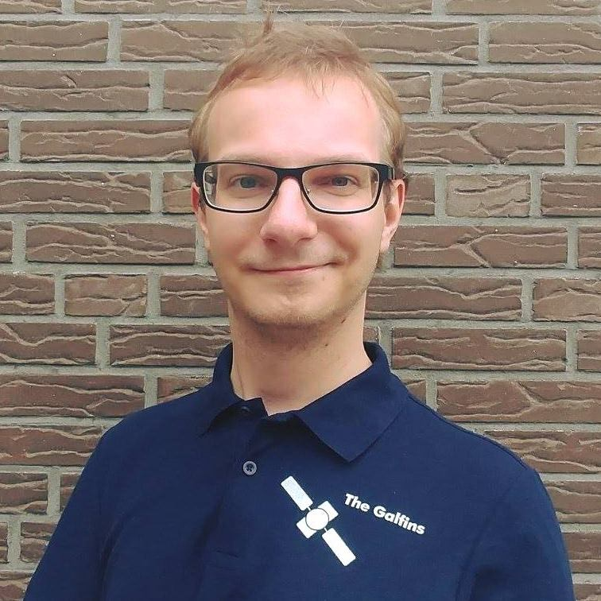

************
Hall of Fame
************

In this section we present you the amazing people that were fueled by
enormous amounts of tea [*]_ in order to develop *GNSS Compare*!

.. [*] Typically it's coffee, but we like to approach things differently. 😊

And here they are! From the left to right we have: Mareike Burba, Sebastian Ciuban, Dominika Perz and Mateusz Krainski.

They all have an impressive set of skills that brought the 1st prize for *GNSS Compare* at the European Space Agency `Galileo Smartphone App Challenge`_. Their knowledge and experience related to **Software Design** and **GNSS Signal Processing** are presented in short biographies so you can have an idea who is behind *GNSS Compare*!

Software Design
===============

Polish Young Graduate Trainee in the Directorate of Human Spaceflight and Robotic Exploration,
at ESTEC, where he supports the European Robotic Arm (ERA) team. His main duties
regard designing, developing and validating a robotic testbed for testing of ERA’s on-board
smart cameras. During studies, Mateusz was one of the key board members of a robotic
student society, where he managed numerous projects ranging from small teams for quick
projects (this includes a Space Startup Weekend, an Android app hackathon and few duringstudies
assignments), organizing robotic tournaments (with a team of over 15 people), up to
technical projects counting over 30 people. Thanks to the Toastmasters International community,
Mateusz has developed highly his public speaking skills. He not only helped start the
first English speaking club in the area, but also received awards in presenting competitions
on a semi-national level.

GNSS Signal Processing
======================

.. _`Galileo Smartphone App Challenge`: http://www.esa.int/Our_Activities/Navigation/ESA_trainees_compete_in_inaugural_Galileo_app_contest
