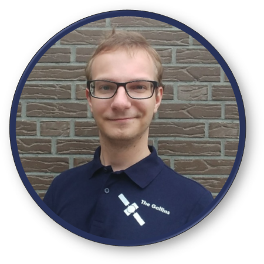
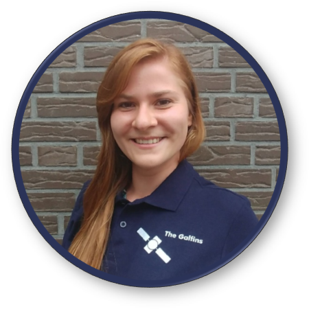
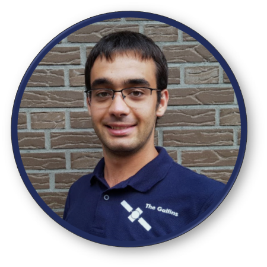
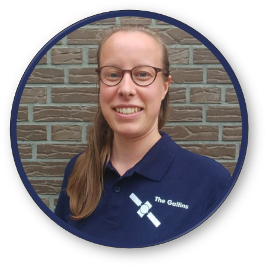

************
Hall of Fame
************

In this section we present you the amazing people that were fueled by
enormous amounts of tea [*]_ in order to develop *GNSS Compare*!

.. [*] Typically it's coffee, but we like to approach things differently. 😊

And here they are! From the left to right we have: Mareike Burba, Sebastian Ciuban, Dominika Perz and Mateusz Krainski.

.. image:: img/Team.jpg
    :width: 60%
    :align: center
    :alt: TheGalfins

They all have an impressive set of skills that brought the 1st prize for *GNSS Compare* at the European Space Agency `Galileo Smartphone App Challenge`_. Their knowledge and experience related to **Software Design** and **GNSS Signal Processing** are presented in short biographies so you can have an idea who is behind *GNSS Compare*!

Software Design
===============

Mateusz Krainski
-----------------

Polish Young Graduate Trainee in the Directorate of Human Spaceflight and Robotic Exploration,
at ESTEC, where he supports the European Robotic Arm (ERA) team. His main duties
regard designing, developing and validating a robotic testbed for testing of ERA’s on-board
smart cameras. During his studies, Mateusz was one of the key board members of a robotic
student society, where he managed numerous projects ranging from small teams for quick
projects (this includes a Space Startup Weekend, an Android app hackathon and few duringstudies
assignments), organizing robotic tournaments (with a team of over 15 people), up to
technical projects counting over 30 people. Thanks to the Toastmasters International community,
Mateusz has developed highly his public speaking skills. He not only helped start the
first English speaking club in the area, but also received awards in presenting competitions
on a semi-national level.

Dominika Perz
-----------------

Polish Young Graduate Trainee in the Technology, Engineering and Quality Directorate at
ESTEC, ESA. Currently working as a Project Manager for the Lunar Exploration Mission
- internal project to determine a preliminary GNC (Guidance, Navigation and Control) design
for the ascent, rendezvous and docking with the Deep Space Gateway station orbiting a
Moon in the highly elliptical orbit. Her background is mainly in robotics and programming.
She completed Control Engineering and Robotics master studies in Poland, during which she
spent one semester in Madrid, Spain as an Erasmus exchange student. As a first international
carrier experience, Dominika did a 6 weeks internship in R&D team at Venderlande (Eindhoven,
Netherlands), where she worked on optimisation of the search algorithm. During
holidays in 2016 she participated in the Aerospace Information Technology Summer School
in Würzburg, Germany. Before coming to ESA, Dominika worked for a year at a software
company GlobalLogic as a Junior Software Developer for embedded systems.

GNSS Signal Processing
======================

Sebastian Ciuban
-----------------

Romanian Young Graduate Trainee in the Directorate of Navigation at the European Space Research and Technology Centre (ESTEC) working
on the Galileo project. He holds a Master of Science degree in Aerospace Systems – Navigation and Telecommunications
granted by the French Civil Aviation University (ENAC) from Toulouse, France. After his first year of master studies he worked
a summer (2016) at Acorde Technologies in Spain in the area of GPS/INS integration. During the second year of studies he developed
his master thesis at the German Aerospace Center (DLR) in Oberpfaffenhofen. While
being at DLR he was responsible with designing and implementing algorithms that fused the
Precise Point Positioning (PPP) technique with Inertial Navigation Systems (INS) in a tight
coupling architecture. Moreover, he has also developed suitable integrity monitoring algorithms
in order to measure the reliability of the designed fused systems in terms of fault detection sensitivity and protection level stability. His research interests are related to precise positioning, sensor fusion, integrity monitoring and GNSS receiver signal
processing.

Mareike Burba
-----------------

German National Trainee with EOP-SMS, currently working on the atmospheric correction
for the Fluorescence Explorer (FLEX). She holds a M.Sc. in Meteorology with a minor in
Scientific Computing from the University of Hamburg. Her Master’s thesis was about optimizing
the numerical computation of atmospheric radiative transfer for the Infrared Atmospheric
Sounding Interferometer (IASI) on MetOp. Mareike previously joined the World
Climate Research Program Joint Planning Staff in the World Meteorological Organization for
a 6 months internship in the framework of the Carlo Schmid program. Thanks to her studies
and jobs as student research assistent, she speaks fluently Python, Matlab, Bash and Fortran,
is communicative in C, Java and IDL, and has some experience with parallel computing.

Contact
========

If you would like to reach any of the *GNSS Compare* developers, here are their e-mails:

- Mateusz Krainski: mateusz@krainski.eu
- Dominika Perz: dominika.perz@gmail.com
- Sebastian Ciuban: ciuban.sebastian@gmail.com
- Mareike Burba: -

.. _`Galileo Smartphone App Challenge`: http://www.esa.int/Our_Activities/Navigation/ESA_trainees_compete_in_inaugural_Galileo_app_contest
