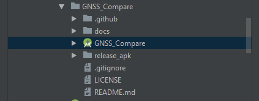

Getting started with the code
=============================

Importing the project to Android Studio
---------------------------------------

It's not necessary to use `Android Studio`_ to make modifications and build code, there are many other IDE's for Android development. It has been our choice so far, so we will be focusing our tutorials on that IDE at the moment.

Before importing the project, you have to clone the project `repository <https://github.com/TheGalfins/GNSS_Compare>`_. The directory ``GNSS_Compare`` within that repository is the Android Studio project.

To import the project into Android Studio, find the *Import Project* option. It should be either under *File* -> *New* -> *Import Project*, or somewhere on the main screen of Android Studio. Navigate to the GNSS_Compare directory. You should find the GNSS_Compare project folder with the Android Studio logo next to it, as shown on image below.

Mark it, click Ok. The project should open and gradle will start to synchronize everything and genrate its configuration files. This can take a moment... After gradle has finished, you're free to connect your phone and build the application by pressing the *Run app* button in the top, right corner.

.. image:: img/run_app.PNG

.. Don't change the title below, as it is linked to the app's map_disabled_layout and map_disabled_description string resource!

Using the Google Maps Viewer
----------------------------

In order to use the Google Maps Viewer in GNSS Comapre, you'll need to get your own Google Maps API key and paste it into the Android manifest (kind of).

To get the Google Maps SDK key, follow this `guide`_.

After you have the key (it will look like a string of random characters, starting with ``AIza``), all you need to do is to copy and paste it to the ``map_api_key.xml`` file located in the ``res/values`` directory. Find the lines containing the following:

.. code-block:: xml

  <string name="map_api_key">YOUR_API_KEY</string>

And replace ``YOUR_API_KEY`` with your API key. It should work right away. If not -- you might need to clean and rebuild your project, or manually uninstall the application on your phone.

Remember not to share the api key with anyone! If you're using git, you can mark that file as one which should not be tracked with

.. code-block:: bash

	git update-index --assume-unchanged app/src/main/res/values/map_api_key.xml

This way, the file will remain in your repository, but any changes made to it will be not pushed to the remote.

.. _`Android Studio`: https://developer.android.com/studio/
.. _`guide`: https://developers.google.com/maps/documentation/android-sdk/signup
