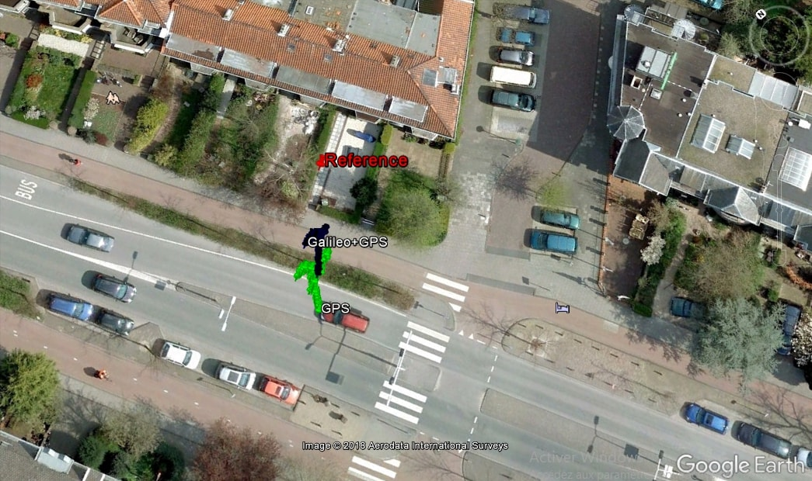
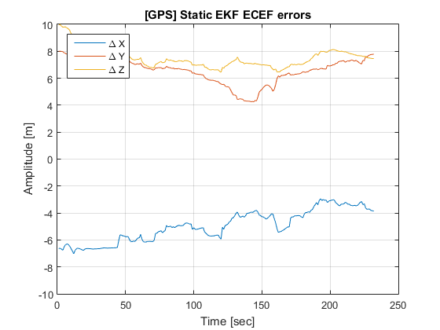
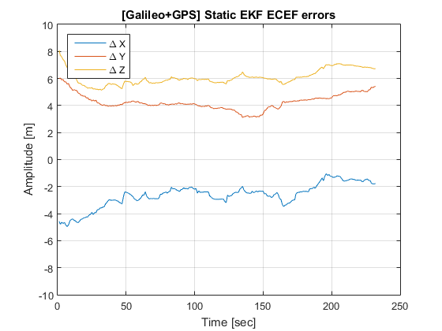
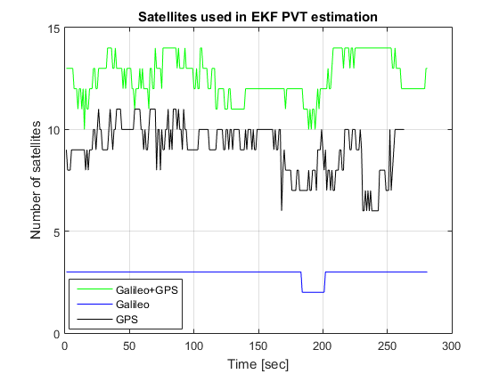
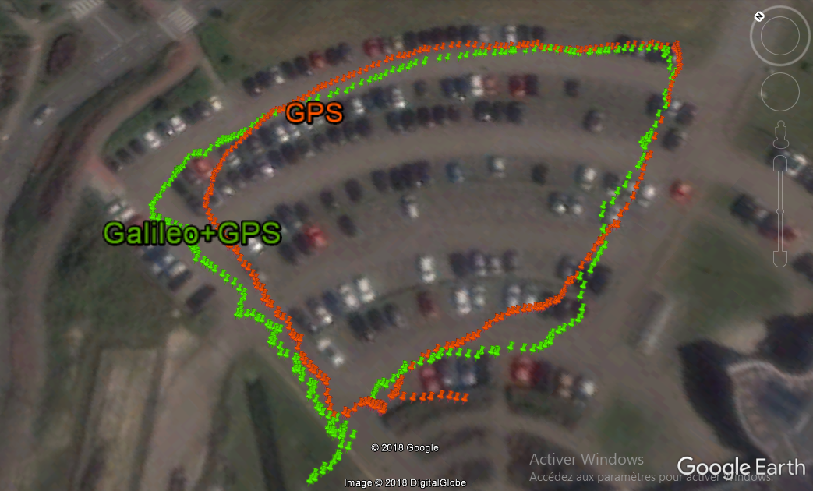
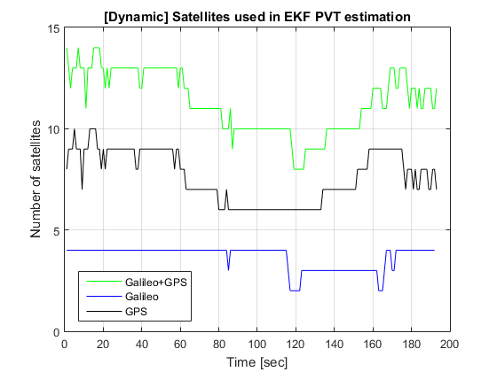
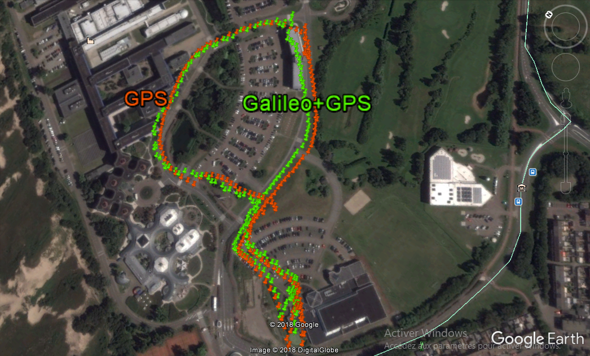

*******************
Example of analysis
*******************

This section provides information about the scenarios in which *GNSS Compare* was tested and the PVT performance
obtained from its estimation algorithms (e.g., Extended Kalman Filter). Furthermore, the analysis
presented here serves also as an example of how GNSS Compare can be used for algorithmic performance assessment.
For a preliminary PVT performance assessment the following scenarios were considered: **Static user**, **Pedestrian user** and **Dynamic user**.

With this section we would like to give you an idea of how *GNSS Compare* can be used. The application allows
data logging (e.g., results of the PVT estimations) in different formats, like NMEA and a custom one. These files
can be retrieved from the phone and then processed in your favourit programming environment for analysis. More details about the
logging formats of *GNSS Compare* will be given soon.

*Note 1: Please be aware that the results presented here are specific to the environment/time when they were generated and they cannot be interpreted in a general sense.*

*Note 2: The Extended Kalman Filters were initialized with the Android FINE location.*

Static user
================

Let's take a look at some details about this scenario:

- Reference location: Latitude 52.16954469, Longitude 4.48089101, Altitude 55.48 m
- Data collection duration: approximately 4 minutes
- Enabled constellations: GPS, Galileo+GPS
- Number of used satellites: 4 Galileo and 5 GPS

After the results of the PVT estimations were obtained from the logged files of *GNSS Compare*, they were projected
in Google Earth as seen in the figure below for an initial analysis.

In this scenario one can observe in the above figure that the computations based on Galileo+GPS are closer to
the reference when compared with GPS only. In order to understand these aspects in a more
detailed manner, the behavior of the errors with respect to the reference can be studied.
The errors are computed based on the cartesian coordinates within the Earth Centered Earth Fixed (ECEF)
frame.

The error evolutions for GPS only PVT are presented in the above figure and it can be directly observed that they are
quite large and with a high variance. Let's see what happens if we add Galileo in the processing.

For the case when the PVT is computed using both Galileo and GPS, the above figure shows improvements when compared
with the solution based only on GPS.

Pedestrian user
===============

This scenario is defined in the following way:

- User dynamics: Walking pedestrian
- Location: The European Space Research and Technology Centre (ESTEC)’s parking lot
- Data collection duration: approximately 4 and half minutes
- Enabled constellations: GPS, Galileo+GPS
- PVT estimator: Extended Kalman Filter
- Number of satellites: On average 3 Galileo and 8 GPS

As for this case there is no reference trajectory available the results are analyzed at the observed satellite level
and at the projection of the estimated position in Google Earth.

In the above figure the estimation of the trajectory that is based only on GPS does not follow too accurately the real
pedestrian motion. However when both Galileo and GPS satellites are used together the position estimation is
improved obtaining a pedestrian path closer to reality.

Dynamic user
============

And the last scenario has the following characteristics:

- User dynamics: Cycling user
- Location: ESTEC
- Data collection duration: approximately 3 minutes
- Enabled constellations: GPS, Galileo+GPS
- PVT estimator: Extended Kalman Filter
- Number of satellites: On average 4 Galileo and 8 GPS

Even with this rather simplistic analysis one can gain some interesting insights. We do hope
that you have now a more clear idea about the possibilities that *GNSS Compare* can open!
