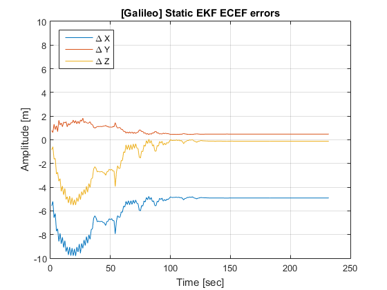

*******************
Example of analysis
*******************

This section provides information about the scenarios in which *GNSS Compare* was tested and the PVT performance
obtained from its estimation algorithms (e.g., Extended Kalman Filter). Furthermore, the analysis
presented here serves also as an example of how GNSS Compare can be used for algorithmic performance assessment.
For a preliminary PVT performance assessment the following scenarios were considered: **Static user**, **Pedestrian user** and **Dynamic user**.

With this section we would like to give you an idea of how *GNSS Compare* can be used. The application allows
data logging (e.g., results of the PVT estimations) in different formats, like NMEA and a custom one. These files
can be retrieved from the phone and then processed in your favourit programming environment for analysis. More details about the
logging formats of *GNSS Compare* will be given soon.

*Note 1: Please be aware that the results presented here are specific to the environment/time when they were generated and they cannot be interpreted in a general sense.*

*Note 2: The Extended Kalman Filters were initialized with the Android FINE location.*

Static user
================

Let's take a look at some details about this scenario:
- Reference location: Latitude 52.16954469, Longitude 4.48089101, Altitude 55.48 m
- Data collection duration: approximately 4 minutes
- Enabled constellations: Galileo, GPS, Galileo+GPS
- Number of used satellites: 4 Galileo and 5 GPS

After the results of the PVT estimations were obtained from the logged files of *GNSS Compare*, they were projected
in Google Earth as seen in the figure below for an initial analysis.

In this scenario one can observe in the above figure that the computations based on Galileo only are closer to
the reference when compared with GPS only or Galileo+GPS. In order to understand these aspects in a more
detailed manner, the behavior of the errors with respect to the reference can be studied.
The errors are computed based on the cartesian coordinates within the Earth Centered Earth Fixed (ECEF)
frame.

In the above figure the errors converge to a stable evolution after approximately 1 minute and a half. This is as expected taking into account that the designed Extended Kalman Filter for a static user was selected in the application. What is also
interesting to notice is that after the convergence time the errors reached a constant-like evolution.

.. image:: imgAnalysis/static_ekfGPS_ecefErrors.png
    :width: 70%
    :align: center
    :alt: TheGalfins

The error evolutions for GPS only PVT are presented in the above figure and it can be directly observed that they are
significantly larger and with a higher variance when compared with the ones from Galileo. A plausible
explanation for the results of this scenario relies on the Galileo signal structure that is based on more modern
modulations, like Binary Offset Carrier (BOC), that have an increased resilience to interference and multipath
leading to a better ranging performance in comparison with signals that have Binary Phase Shift Keying (BPSK)
modulations like GPS L1 C/A.

.. image:: imgAnalysis/static_ekfGalileo+GPS_ecefErrors.png
    :width: 70%
    :align: center
    :alt: TheGalfins

For the case when the PVT is computed using both Galileo and GPS, the above figure shows improvements when compared
with the solution based only on GPS.

Pedestrian user
===============

Dynamic user
============
