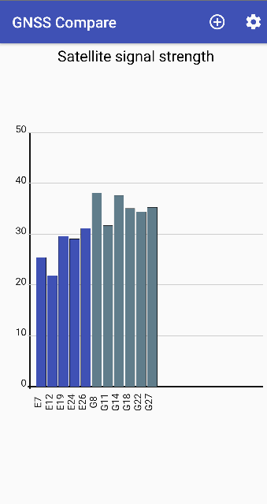
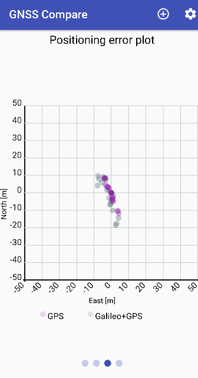
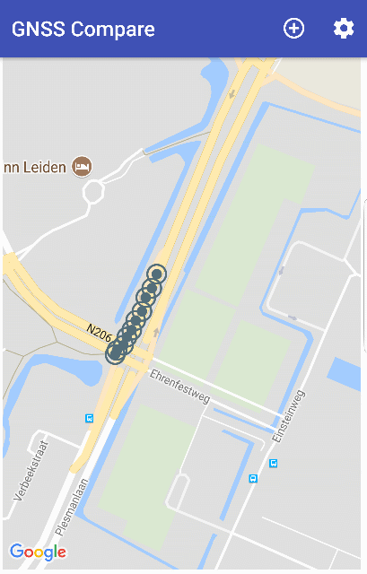
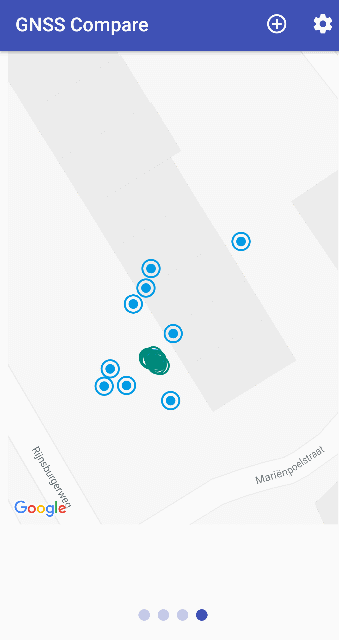
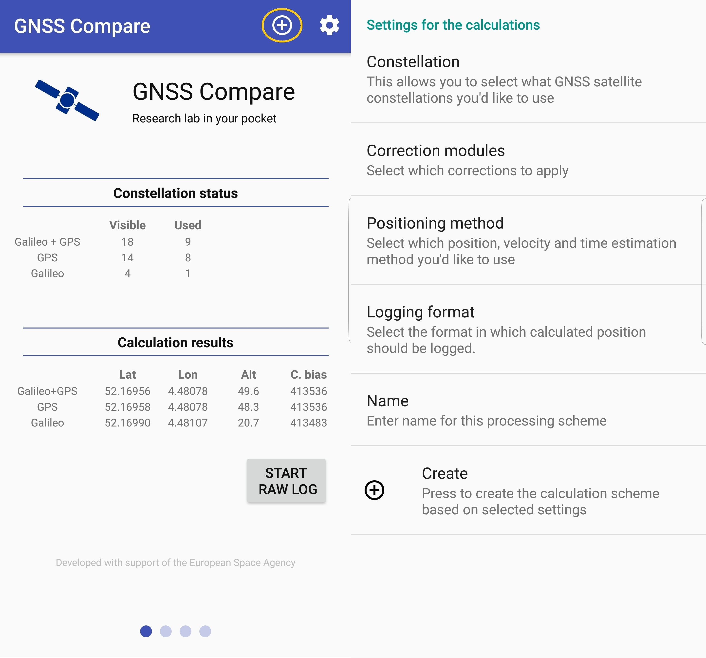
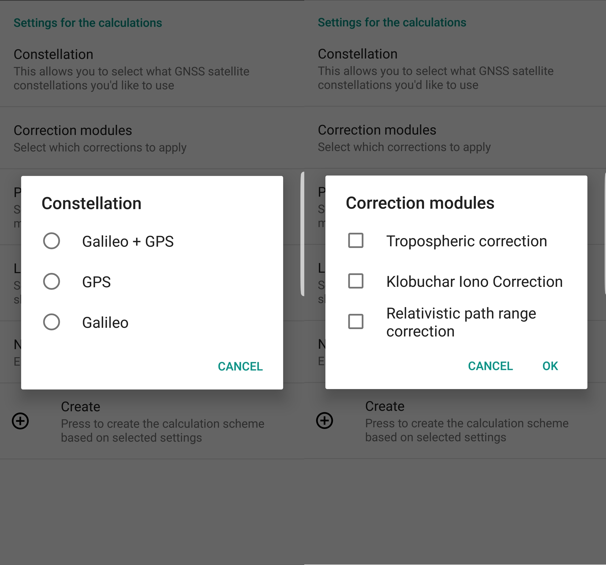
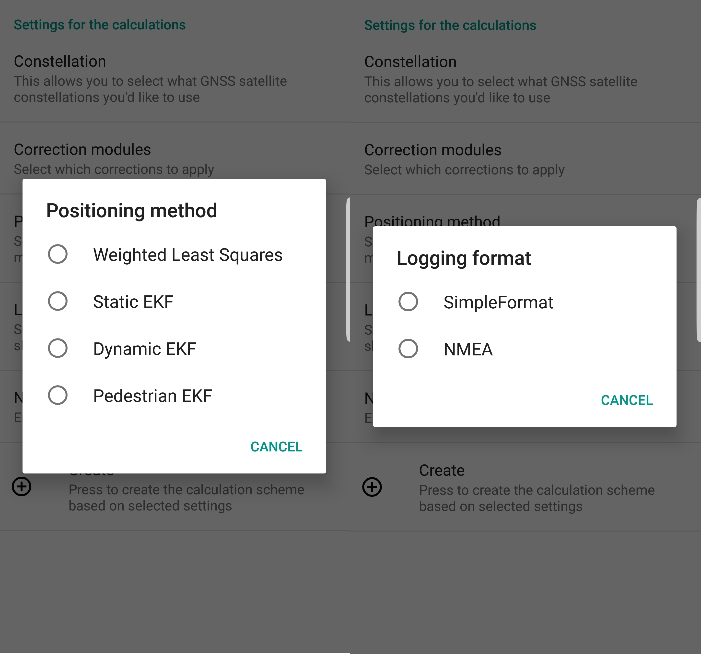
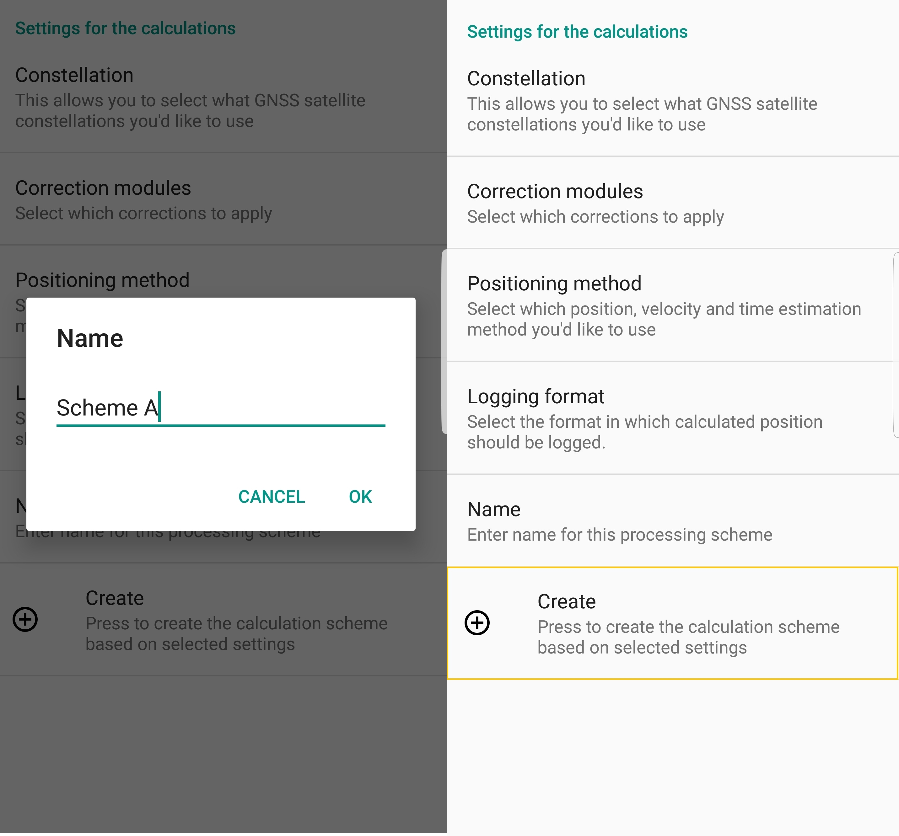
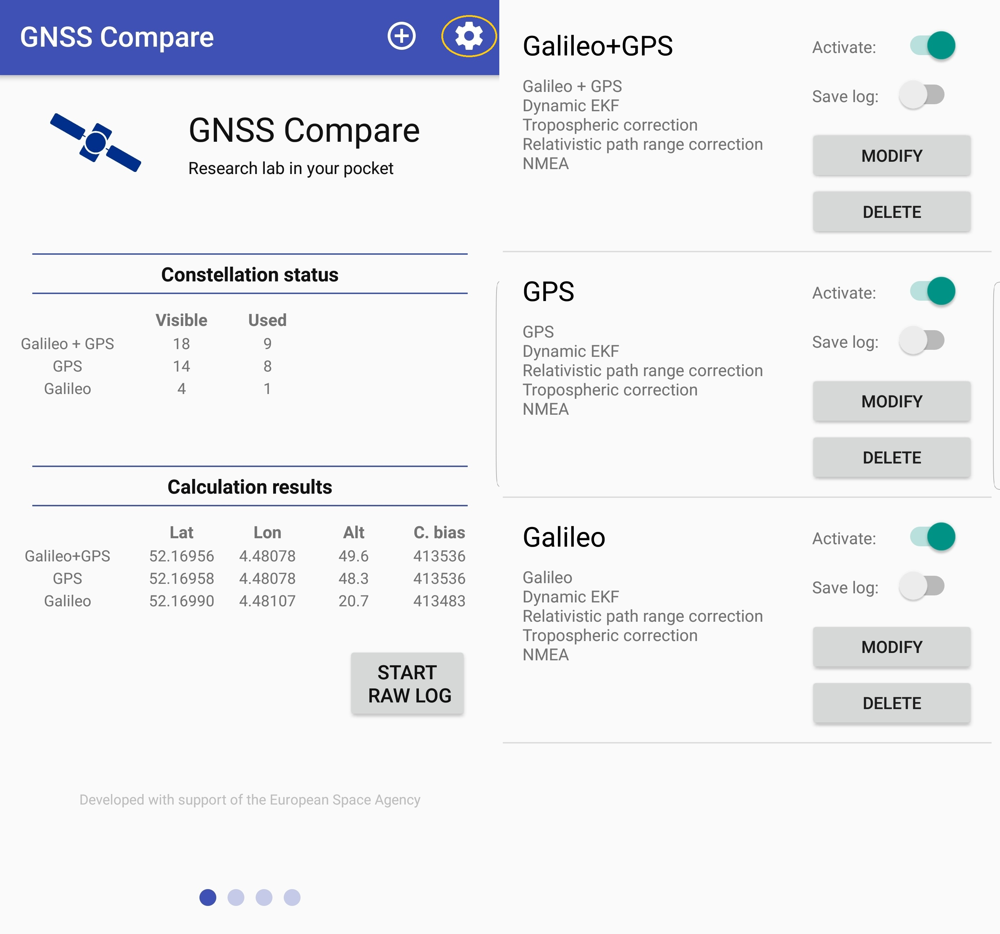

***************************************
Getting started with the User Interface
***************************************

Here we show what you can see at the User Interface (UI) level and we also
describe how to set up different processing schemes/calculation module, effect of which can be studied in
real-time.

Application's Views
===================

We refer to a *view* as the current content displayed by the application. The user
can change these views by swiping on the phone's screen. Curently we have the following
views: **Main View**, **Satellite signal strength**, **Positioning error plot** and **Google Maps view**.

Main View
---------

When you launch the application this is the first view.

.. image:: img/MainView.gif
      :width: 50%
      :align: center

On top you have a blue "stripe" with the name of the application, a "+" and a "gearbox" icon. What are the
functionalities of those icons we will see in the :ref:`Setting a processing scheme` part.

Next is the **Constellation status** header and the information below of it shows you what GNSS constellations and how many satellites are used to compute PVT. In the GIF above we can see that a combination of Galileo+GPS, GPS only and Galileo only are considered in the algorithms. Moreover, you can notice that not all *Visible* satellites are being *Used* in the calculations.
The reason behind this is exaplined in a dedicated chapter of this documentation called :ref:`Android GNSS raw measurements`. Shortly, it is because not all obtained pseudoranges pass a criteria that would allow them to be used in the PVT estimation.

Below the header called **Calculation results** are the results of the PVT estimators (EKF for this particular example) in terms of: latitude ( *Lat* ), longitude ( *Lon* ), altitude ( *Alt* ) and the receiver's clock bias ( *C.bias* ). The UI allows it's user to make some interesting analysis
and to gain some intuitions about the importance of the number of the used satellites in PVT. As example, because there are only 3 Galileo satellites used in the EKF we do expect the estimations of the unknowns to be degraded, which is the case.

And lastly, the *START RAW LOG* allows the logging of the Android GNSS raw measurements in the exact same format as the
Google's Application `GNSS Logger`_. This feature allows you also to do analyze your data in post-processing!

To get to the next view just swipe from right to left.

Satellite signal strength
--------------------------

This view is quite straight forward. Here you can monitor the signal strenght of the satellites that are *Used*
in the calculations.

To get to the next view just swipe from right to left or to return to the previous one, from left to right.

Positioning error plot
----------------------

To have an idea of how well the position is estimated, we provide this view that contains a plot with the horizontal
position errors using as reference the *Android FINE location* (i.e., the best location output by the phone). The
errors are expressed in meters in the north and east direction (local frame).

Below the plot there is the legend with the specific colors for the chosen processing schemes/configurations.

To get to the next view just swipe from right to left or to return to the previous one, from left to right.

Google Maps view
----------------

In the last view there is the Google Maps on which the position estimations are displayed to be monitored. This can be useful
especially when you are testing new PVT algorithms or change the settings of the existing ones (e.g., tunning the EKF). In the
GIF below are presented the position estimations by the EKF while the user was in a bus. In this way you can study if your
algorithms and their tunning are able to output estimations that follow your dynamics in real-time.

Another useful study that can be made in this view is the comparison of different PVT algorithms. In the example below, one can
gain insights about the difference between WLS and EKF. It is interesting to see the performance of an estimator that relies
only on measurements relative to an estimator that uses a dynamic model in addition.

To get to the the previous view swipe from left to right.

Processing schemes
===================

By a processing scheme or a calculation module we refer to a set of settings that are considered for the estimation of the
smartphone's position. The user can create a processing scheme in which he/she can choose the following:

- Constellation: *Galileo+GPS, GPS, Galileo*

- Correction modules: *Tropospheric correction, Klobuchar Iono Correction (only for GPS), Relativistic path range correction*

- Positioning method: *Weighted Least Squares, Static EKF, Dynamic EKF, Pedestrian EKF*

- Logging format: *Simple format, NMEA*

- Name: *The user shall specify the name of the processing scheme*

We will continue to show how to create a processing scheme or modify an existing one at the UI level.

Creating a new one
------------------

From the *Main View* select the "+" icon on the top right corner as shown below. A new view will prompt that will
allow you to select among the available options.

Let's begin by selecting the desired *Constellation* and *Correction modules*, one at a time.

Next we would like to select the *Positioning method* and the *Logging format*.

Finally we have to give a *Name* to the processing scheme and then press *Create*.

Modifying an existing one
-------------------------

To modify an existing processing scheme, from the *Main View* press the "gearbox" icon as shown below.

.. _`GNSS Logger`: https://github.com/google/gps-measurement-tools/tree/master/GNSSLogger
